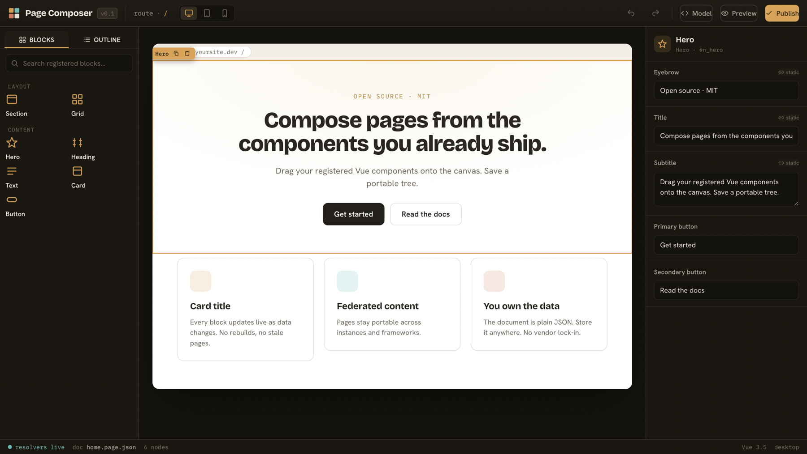
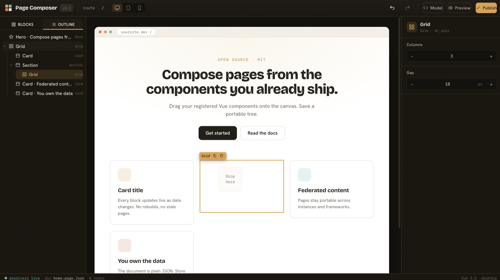

# Page Composer

A visual page editor you embed in your own Vue or Nuxt app. Register the components you already ship, drag them onto a canvas, and save a portable JSON document that renders on any route. MIT, no backend assumptions, no vendor lock-in.

The closest reference point is Puck in the React world. Page Composer fills the same gap for Vue and Nuxt, and adds visual data binding on top.



## Two pieces

- `<PageComposer>`, the authoring surface: palette, canvas, inspector, outline.
- `<ComposedPage>`, the runtime that turns a saved document into a real page using your components.

Both read the same config object, where you list the components an author may place and the fields that drive their props. The config is the contract. The same renderer powers the editor canvas and production, so what you author is what ships.



## Install

```bash
pnpm add vue-page-composer
```

```ts
import 'vue-page-composer/styles.css'
import { PageComposer, ComposedPage, definePageConfig } from 'vue-page-composer'
```

See [docs/getting-started.md](docs/getting-started.md) for the full walkthrough.

## Highlights

- Author with your real, registered Vue components. No re-implementation, no iframe lock-in to a vendor.
- Portable JSON document, a flat node map you own and persist anywhere.
- Visual data binding: any field can read from the host data layer through a `$bind` expression resolved at render time.
- Polished editor: searchable palette, axis-aware drop indicator, accessible outline tree, undo and redo, copy and paste, duplicate, keyboard shortcuts, viewport preview.
- Controlled component. The host owns saving, drafts, and history.

## Packages

| Package               | What it is                                                                               |
| --------------------- | ---------------------------------------------------------------------------------------- |
| `@page-composer/core` | Framework-neutral document model, mutations, history, serialization, resolver interface. |
| `@page-composer/vue`  | The Vue editor and renderer.                                                             |
| `vue-page-composer`   | Friendly alias for `@page-composer/vue`.                                                 |
| `nuxt-page-composer`  | The Nuxt module (in progress).                                                           |

## Documentation

- [Getting started](docs/getting-started.md)
- [Configuration and field types](docs/configuration.md)
- [Data binding](docs/data-binding.md)
- [Keyboard shortcuts](docs/keyboard-shortcuts.md)
- [How it compares](docs/comparison.md)
- [Architecture](page-composer-architecture.md) and [build plan](page-composer-plan.md)

## Try it

A runnable demo lives in `playground/`:

```bash
pnpm install
pnpm --filter playground dev
```

## Develop

```bash
pnpm -r test      # every package test suite
pnpm -r build     # build every package
pnpm lint         # eslint across the workspace
pnpm format       # prettier write
```

Layout:

```
packages/core    @page-composer/core
packages/vue     @page-composer/vue
packages/dnd     @page-composer/dnd      (planned)
packages/fields  @page-composer/fields   (planned)
packages/nuxt    @page-composer/nuxt     (planned)
aliases/*        vue-page-composer, nuxt-page-composer
playground/      runnable demo app
```

## License

MIT. Copyright Moheeb Zara.
